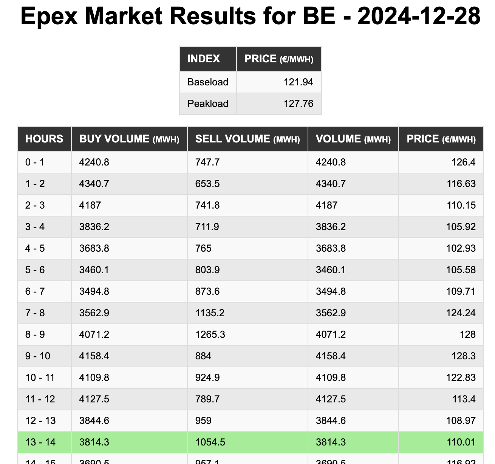

# Epex Client

The *Epex Client* package provides access to the latest European Power Exchange (EPEX) market data **across all areas**.
It is intended primarily for hobbyist solutions.

[](https://www.gnu.org/licenses/gpl-3.0)
[](https://www.npmjs.com/package/@tvanlaerhoven/epex-client)





## Overview

The **European Power Exchange (EPEX SPOT)** is a [market platform](https://www.epexspot.com/) for 
the trading of electricity in Europe. 
It provides a marketplace for electricity producers, consumers, and traders to buy and sell electricity, 
aiming to create a transparent and efficient market for power trading. 

The *Epex Client* package gives you access to the EPEX Spot Day-Ahead Market, where the electricity price and volume
for each hour of the next day is established.
You can work with these Day-Ahead prices by adjusting your electricity consumption patterns based on the price 
fluctuations. Here's how:

- **Shift High Consumption Activities**: reduce energy costs by scheduling energy-intensive activities (like running washing machines, dishwashers, or electric heating) during hours when electricity prices are lower.
- **Use Home Automation**: home automation systems or smart appliances can automatically adjust the timing of electricity usage based on the predicted lower-cost periods provided by the Epex-client.
- **Energy Storage**: energy storage systems (like batteries) can store electricity during low-price hours and use it during peak-price hours.

## Installation

```sh
npm i @tvanlaerhoven/epex-client
```

or

```sh
yarn add @tvanlaerhoven/epex-client
```

## Usage

First create an Epex client, with optional configuration.
The `debug` property allows for extra logging during usage of the client.

```typescript
import * as Epex from '@tvanlaerhoven/epex-client';

const client = new Epex.Client({ debug: true });
```

### Accessing day-ahead market data

The day-ahead market data contains the established electricity prices and quantities for a selected region, 
based on supply and demand. As an example. the data for `MarketArea.Belgium` can be requested as follows:

```typescript
try {
    // Get today's hourly market data
    const data = await client.getDayAheadMarketData(Epex.MarketArea.Belgium, Epex.today());
    console.log(`Today's electricity price from 9h-10h is €${data.entries[9].price}`);
} catch(error) {
    console.error(error.message);
}
```

The requested delivery date is passed as a string `"YYY-MM-DD"`, or using the convenient methods `Epex.today()` and
`Epex.tomorrow()`. 
Note that prices for the next day are typically available **in the early afternoon** on the day before delivery.

### Displaying market data in a browser

The Epex website does not allow browser requests from any other location than its own host 
([CORS](https://en.wikipedia.org/wiki/Cross-origin_resource_sharing)). To solve this, run a local
proxy server that drops any CORS headers from the http request.

```typescript
import * as Epex from '@tvanlaerhoven/epex-client';

const client = new Epex.Client({ proxyServer: 'http://localhost:8088', debug: true });
```

The [example](https://github.com/tvanlaerhoven/epex-client/tree/main/example) demonstrates this. Try it by running:

```sh
npm run example
```

The output is a page where you can choose to either visualize today's market prices in table or as a bar graph.


